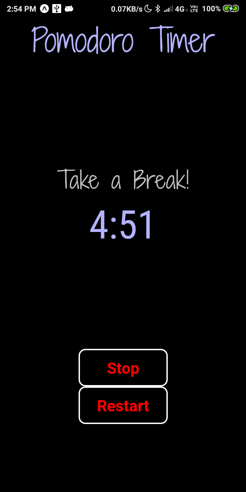

# PomoDoro-Timer

Pomodoro is a technique to increase your productivity and to manage time better  
A goal of the technique is to reduce the impact of internal and external interruptions on focus and flow. 

```
There are seven steps in this technique:
1.Decide on the task to be done.
2.Start the pomodoro timer (25 minutes).
3.Work on the task.
4.End work when the timer rings and put a checkmark on a piece of paper.
5.If you have fewer than four checkmarks, take a short break of 5 minutes.
6.After four pomodoros, press "Stop" and take a longer break (15–30 minutes). 
7.Press "Reset" and start working again.

```
## Functions


Start:To start a Pomodoro. <br/>
Stop :To pause a Pomodoro. <br/>
Reset:To reset a Pomodoro.

## Link to download the app

[Click Here](https://expo.io/artifacts/ab35e607-13d5-4061-b3d0-1cb8c70812f5)

## Some Screenshots

|                                     |                                     |                                     |
|-------------------------------------|-------------------------------------|-------------------------------------|
||||


